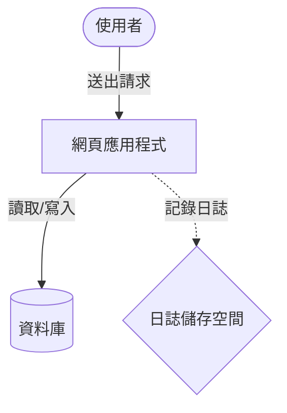

# [文件標題：請輸入簡短、具備行動導向的標題]

> 💡 **簡短摘要**：用 1-2 句話說明此文件的核心內容，讀者能藉此學會什麼或解決什麼問題。

---

## 🎯 前置準備 (Prerequisites)

在開始之前，請確保您的環境已符合以下條件：
- **必備工具**：[例如：Docker Desktop v4.x+, Terraform CLI v1.5+]
- **先備知識**：[例如：基礎的 Linux 終端機指令、基礎的 AWS 帳戶權限]
- **範例程式碼**：[若有提供專案/Repository 連結，請放在這裡]

---

## 🗺️ 架構與運作原理 (Architecture & Overview)

*此處可提供系統架構說明，強烈建議使用 Mermaid 圖表，讓讀者一目了然：*



---

## 🚀 步驟教學 (Step-by-Step Guide)

### 步驟 1：[步驟名稱，如：初始化環境]

說明此步驟的目的：

```bash
# 執行初始化指令
your-init-command --option value
```

> 📝 **注意事項**：如果在此步驟遇到 X 錯誤，通常是因為 Y，請參考下方 [常見問題](#-常見問題--故障排除-troubleshooting)。

### 步驟 2：[步驟名稱，如：配置核心設定]

說明此步驟的細節與範例設定檔：

```hcl
# 範例設定檔 (以 Terraform HCL 為例)
resource "example_resource" "main" {
  name        = "my-resource"
  environment = "production" # 建議此處使用註解解釋參數意義
}
```

---

## 🛡️ 最佳實踐與安全建議 (Best Practices & Security)

在實際部署或開發時，請遵循以下原則：
- **機敏資訊保護**：切勿將密碼、API Key 或私鑰寫死在程式碼或設定檔中，應使用環境變數或秘密管理工具（如 AWS Secrets Manager）。
- **版本控制**：建議將設定檔與基礎架構代碼（IaC）提交至 Git 進行版本控管。

---

## 🔍 常見問題 & 故障排除 (Troubleshooting)

### Q1: [常見問題 1 描述，例如：執行時出現 Connection Timeout]
- **原因**：[說明背後的原因，例如：防火牆規則未允許特定 Port 通過]
- **解決方案**：
  1. 檢查並更新安全性群組 (Security Group)
  2. 重新執行指令：`ping google.com`

---

## 📚 延伸閱讀 (References & Further Reading)
- [官方文件連結 1](https://example.com)
- [相關文章 2](https://example.com)
