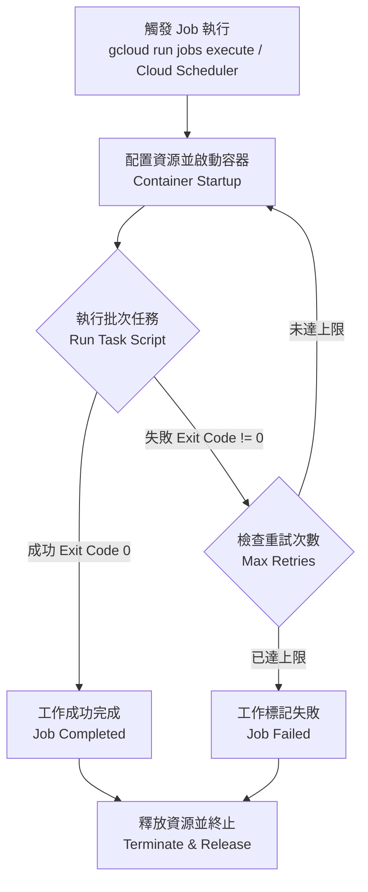

# 🚀 GCP Cloud Run 工作 (Job) YAML 部署與生命週期指南

本文件旨在詳細介紹如何在 Google Cloud Platform (GCP) 上透過宣告式的 YAML 設定檔來部署與管理 **Cloud Run 工作 (Cloud Run Job)**。

---

## 一、 🚀 簡介與使用時機

在 Cloud Run 中，您可以透過 `gcloud run jobs replace` 指令直接套用 YAML 檔案來建立或更新批次工作。

### 為什麼選擇 YAML 部署工作？
1. **版本控制**：將批次任務與排程設定放入 Git 儲存庫進行版控。
2. **重現性**：確保測試與生產環境中的資料同步與批次作業完全一致。
3. **複雜參數管理**：精準控制平行執行數 (`taskCount`)、重試機制 (`maxRetries`) 與逾時設定 (`timeoutSeconds`)。

---

## 二、 🔄 Cloud Run Job 執行生命週期

以下 Mermaid 流程圖展示了 Cloud Run Job 從觸發、執行到終止的生命週期：



---

## 三、 📁 YAML 設定檔結構與完整範例

### 1. 核心結構解析
Cloud Run Job 支援使用遵循 Kubernetes 資源定義風格的 YAML 檔案進行宣告式管理 (`apiVersion: run.googleapis.com/v1`, `kind: Job`)。

### 2. 生產環境完整範例 (`job-definition.yaml`)
```yaml
apiVersion: run.googleapis.com/v1
kind: Job
metadata:
  name: data-sync-batch-job
  namespace: 'my-gcp-project-id'
  labels:
    team: data-engineering
    env: production
spec:
  template:
    metadata:
      annotations:
        run.googleapis.com/vpc-access-connector: projects/my-gcp-project-id/locations/asia-east1/my-vpc-connector
        run.googleapis.com/vpc-access-egress: all-traffic
        run.googleapis.com/cloudsql-instances: my-gcp-project-id:asia-east1:my-postgres-db
    spec:
      taskCount: 1
      template:
        spec:
          timeoutSeconds: 1800
          maxRetries: 2
          containers:
            - image: asia-east1-docker.pkg.dev/my-gcp-project-id/batch-repo/data-sync:v1.2.0
              command: ["python", "-m", "etl.sync_job"]
              resources:
                limits:
                  cpu: "2000m"
                  memory: "4Gi"
              env:
                - name: ENVIRONMENT
                  value: "production"
                - name: BATCH_SIZE
                  value: "5000"
                - name: DB_HOST
                  value: "/cloudsql/my-gcp-project-id:asia-east1:my-postgres-db"
                - name: API_SECRET_KEY
                  valueFrom:
                    secretKeyRef:
                      name: my-api-secret
                      key: latest
          serviceAccountName: data-job-sa@my-gcp-project-id.iam.gserviceaccount.com
```

---

## 四、 🛠️ 部署與管理指令

* **建立或更新 Job**：
  ```bash
  gcloud run jobs replace job-definition.yaml --region=asia-east1
  ```
* **手動觸發執行 Job**：
  ```bash
  gcloud run jobs execute data-sync-batch-job --region=asia-east1 --wait
  ```
* **查看 Job 執行狀態與日誌**：
  ```bash
  gcloud run jobs list --region=asia-east1
  gcloud run jobs executions list --job=data-sync-batch-job --region=asia-east1
  ```

---

## 五、 💡 最佳實務與注意事項

1. **最小權限原則 (Least Privilege IAM)**：為每個 Job 建立專屬的 Service Account。
2. **妥善設定逾時與重試**：針對批次作業設定合理的 `timeoutSeconds` 與 `maxRetries`。
3. **結合 Cloud Scheduler**：透過 Cloud Scheduler 定期呼叫 Cloud Run Admin API 觸發 Job。
4. **成本優化**：Job 僅按實際執行秒數計費，執行完畢立即釋放資源。

