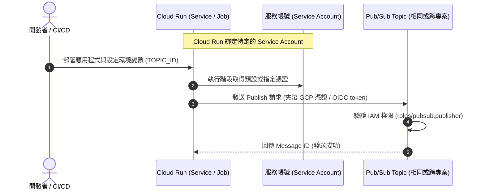
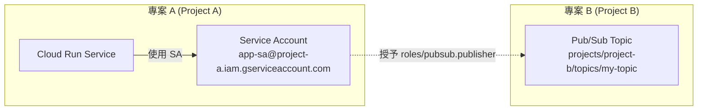

# Google Cloud Cloud Run 發送 Pub/Sub Message 技術指南

本指南詳細說明如何讓 Google Cloud `Cloud Run`（Service 或 Job）安全地發送訊息至 Google Cloud Pub/Sub Topic，涵蓋**相同專案（Same Project）**與**跨專案（Cross-Project）**的情境，並列出所需的 IAM 權限與完整運作流程。

---

## 📋 1. 架構總覽與運作流程

Cloud Run 發送 Pub/Sub 訊息主要透過 **IAM 服務帳號（Service Account）** 進行身分驗證，並透過 Pub/Sub Client Library（或直接呼叫 Pub/Sub REST API）將訊息推送至指定的 Topic。



---

## 🔑 2. IAM 權限與角色配置

無論是相同專案還是跨專案，核心原則都是：**賦予 Cloud Run 所使用的 Service Account 目標 Pub/Sub Topic 或專案的「發布者」權限**。

### 所需角色說明
- **角色名稱**：`Pub/Sub Publisher`
- **角色 ID**：`roles/pubsub.publisher`
- **權限內容**：允許向指定的 Pub/Sub Topic 發送訊息（`pubsub.topics.publish`）。

---

## 🔄 3. 情境一：相同專案（Same Project）發送流程

在相同專案中，Cloud Run 預設會使用專案的 **Compute Engine 預設服務帳號** 或自訂的服務帳號。

### 步驟 1：確認或建立 Cloud Run 服務帳號
建議為 Cloud Run 建立專屬的最小權限服務帳號（例如：`cloud-run-publisher@your-project-id.iam.gserviceaccount.com`）。

### 步驟 2：賦予 Pub/Sub 發布權限
將 `roles/pubsub.publisher` 角色賦予該服務帳號，對象可以是**特定的 Pub/Sub Topic**（建議，符合最小權限原則）或**整個專案**。

* **透過 gcloud 指令設定特定 Topic 權限**：
  ```bash
  gcloud pubsub topics add-iam-policy-binding my-topic \
      --member="serviceAccount:cloud-run-publisher@your-project-id.iam.gserviceaccount.com" \
      --role="roles/pubsub.publisher"
  ```

### 步驟 3：部署 Cloud Run 並綁定服務帳號
```bash
gcloud run services deploy my-cloud-run-service \
    --image=gcr.io/your-project-id/your-image:latest \
    --service-account=cloud-run-publisher@your-project-id.iam.gserviceaccount.com \
    --set-env-vars=TOPIC_NAME=projects/your-project-id/topics/my-topic \
    --platform=managed \
    --region=asia-east1
```

---

## 🌐 4. 情境二：跨專案（Cross-Project）發送流程

當 Cloud Run 位於 **專案 A (Project A)**，而 Pub/Sub Topic 位於 **專案 B (Project B)** 時，必須進行跨專案的 IAM 授權。



### 步驟 1：在專案 A 準備 Cloud Run 服務帳號
假設專案 A 的服務帳號為：
`app-sa@project-a.iam.gserviceaccount.com`

### 步驟 2：在專案 B 的 Pub/Sub Topic 上授權給專案 A 的服務帳號
切換至專案 B，將專案 A 的服務帳號加入專案 B 目標 Topic 的 IAM Policy 中：

```bash
gcloud pubsub topics add-iam-policy-binding projects/project-b/topics/my-topic \
    --member="serviceAccount:app-sa@project-a.iam.gserviceaccount.com" \
    --role="roles/pubsub.publisher"
```

### 步驟 3：在專案 A 部署 Cloud Run
部署時，確保 Cloud Run 使用專案 A 的 `app-sa@project-a.iam.gserviceaccount.com`，並將環境變數中的 Topic 完整路徑指向專案 B：

```bash
gcloud run services deploy my-cross-project-service \
    --image=gcr.io/project-a/my-app:latest \
    --service-account=app-sa@project-a.iam.gserviceaccount.com \
    --set-env-vars=TOPIC_NAME=projects/project-b/topics/my-topic \
    --platform=managed \
    --region=asia-east1
```

---

## 💻 5. 程式碼實作範例 (Node.js / Python)

Cloud Run 程式碼本身不需要額外設定金鑰檔案（JSON Key），因為 Google Cloud 執行環境會自動透過 **Metadata Server** 取得綁定之 Service Account 的憑證。

### Node.js 範例 (`index.js`)
```javascript
const { PubSub } = require('@google-cloud/pubsub');
const pubsub = new PubSub(); // 自動抓取環境中的 Service Account 憑證

async function sendPubSubMessage(topicName, dataObject) {
  try {
    const dataBuffer = Buffer.from(JSON.stringify(dataObject));
    const messageId = await pubsub.topic(topicName).publishMessage({ data: dataBuffer });
    console.log(`Message ${messageId} published successfully.`);
    return messageId;
  } catch (error) {
    console.error(`Error publishing message:`, error);
    throw error;
  }
}
```

### Python 範例 (`main.py`)
```python
import os
import json
from google.cloud import pubsub_v1

publisher = pubsub_v1.PublisherClient()
TOPIC_NAME = os.environ.get("TOPIC_NAME")  # e.g., projects/project-b/topics/my-topic

def send_message(data_dict):
    data_str = json.dumps(data_dict)
    data = data_str.encode("utf-8")
    
    future = publisher.publish(TOPIC_NAME, data)
    message_id = future.result()
    print(f"Published message ID: {message_id}")
    return message_id
```

---

## ✅ 6. 常見排查與注意事項 (Troubleshooting)

1. **`403 Permission Denied` 錯誤**：
   - **原因**：Cloud Run 當前使用的 Service Account 未被賦予目標 Topic 的 `roles/pubsub.publisher`。
   - **檢查點**：確認 Cloud Run 執行的 Service Account 信箱是否與綁定 IAM 的信箱完全相符。
2. **跨專案 Topic 路徑格式錯誤**：
   - **檢查點**：跨專案發送時，Topic 名稱必須使用完整完整資源名稱：`projects/<PROJECT_ID_OR_NUMBER>/topics/<TOPIC_NAME>`，而非僅填寫 Topic ID。
3. **API 啟用狀態**：
   - **檢查點**：跨專案情境下，若專案 A 的 Cloud Run 需要呼叫專案 B 的 Pub/Sub，確保專案 B 的 **Cloud Pub/Sub API** 已正常啟用。
