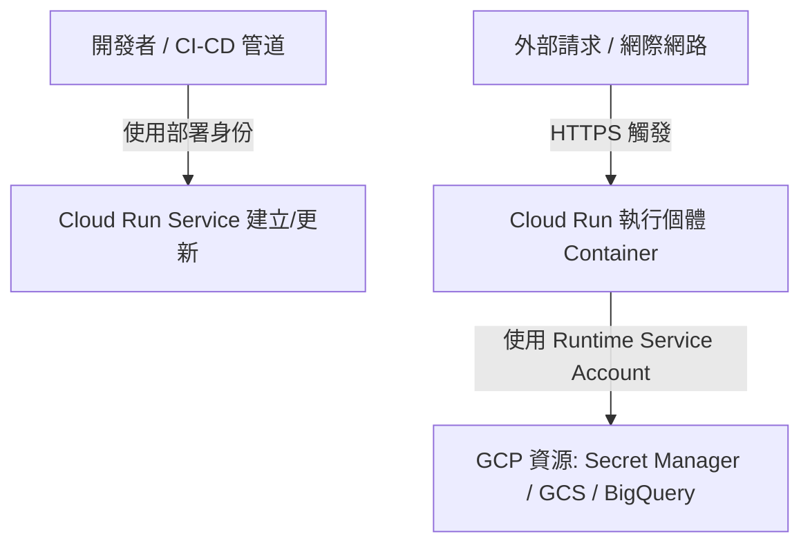

# 🔐 GCP Cloud Run 服務帳戶 (Service Account) IAM 權限設定完整指南

本文件旨在詳細介紹在 Google Cloud Platform (GCP) 上執行 **Cloud Run** 時，如何妥善規劃、建立與設定 **Service Account (服務帳戶)** 及其 **IAM 權限**。落實最小權限原則（Least Privilege Principle）是確保雲端架構安全的核心關鍵。

---

## 一、 🚀 核心概念與架構

在 GCP 中，Cloud Run 服務運作時主要涉及兩種不同層級的身份與權限：
1. **執行身份 (Runtime Service Account)**：您的應用程式在容器內部執行時所使用的身份。當程式碼呼叫 Google Cloud API（如 BigQuery、Cloud Storage、Secret Manager 等）時，會以此帳戶授權。
2. **部署身份 (Deployer Identity)**：CI/CD 管道（如 Cloud Build、GitHub Actions）或開發者本人用來將映像檔部署至 Cloud Run 的身份。



---

## 二、 🛡️ 執行身份 (Runtime Service Account) 權限設定

依預設，若未特別指定，Cloud Run 會使用專案的 **Default Compute Service Account** (`PROJECT_NUMBER-compute@developer.gserviceaccount.com`)。此預設帳戶通常擁有過大的專案編輯者（Editor）權限，**強烈建議在正式環境中建立自訂的 Service Account**。

### 1. 建立專屬 Service Account
透過 `gcloud` 指令建立一個最小權限的服務帳戶：
```bash
# 設定變數
PROJECT_ID="your-project-id"
SA_NAME="cloud-run-runtime-sa"
REGION="asia-east1"

# 建立服務帳戶
gcloud iam service-accounts create $SA_NAME \
    --description="Cloud Run service runtime account" \
    --display-name="Cloud Run Runtime SA"
```

### 2. 常見應用場景與對應的 IAM Role
根據您的 Cloud Run 應用程式實際存取的 GCP 資源，授予對應的 IAM 角色：

| 應用場景 | 必要的 GCP IAM Role | 指令範例 |
| :--- | :--- | :--- |
| **讀取 Secret Manager 機密** | `roles/secretmanager.secretAccessor` | 授權存取特定 Secret |
| **讀寫 Cloud Storage (GCS) 儲存桶** | `roles/storage.objectAdmin` 或 `objectViewer` | 授權存取特定 Bucket |
| **寫入 Cloud Logging / Monitoring** | `roles/logging.logWriter` (預設具備) | Cloud Run 系統預設支援 |
| **連線 Cloud SQL (PostgreSQL/MySQL)** | `roles/cloudsql.client` | 授權連接資料庫執行個體 |

#### 指令範例：授權讀取 Secret Manager
```bash
gcloud secrets add-iam-policy-binding my-secret \
    --member="serviceAccount:${SA_NAME}@${PROJECT_ID}.iam.gserviceaccount.com" \
    --role="roles/secretmanager.secretAccessor"
```

---

## 三、 📝 在部署設定中綁定 Service Account

當您透過 YAML 或 Terraform 部署 Cloud Run 服務時，必須明確指定 `serviceAccountName`。

### 1. 透過 Service YAML 指定
在 `service.yaml` 的 `spec.template.spec` 區段中加入 `serviceAccountName`：

```yaml
apiVersion: serving.knative.dev/v1
kind: Service
metadata:
  name: secure-cloud-run-app
  labels:
    cloud.googleapis.com/location: asia-east1
spec:
  template:
    spec:
      serviceAccountName: cloud-run-runtime-sa@your-project-id.iam.gserviceaccount.com
      containers:
        - image: gcr.io/your-project-id/my-app:v1.0.0
          ports:
            - containerPort: 8080
          resources:
            limits:
              cpu: "1000m"
              memory: "512Mi"
```

### 2. 透過 Terraform 指定（包含權限綁定完整範例）

在 Terraform 中，除了建立 Cloud Run 服務外，通常也會同時宣告 **Service Account**、授予該帳戶存取特定資源（如 Secret Manager）的 **IAM 角色**，以及設定對外公開或受保護的 **Invoker 權限**。

以下是一個完整的 Terraform 設定範例 (`main.tf`)：

```hcl
terraform {
  required_version = ">= 1.3.0"
  required_providers {
    google = {
      source  = "hashicorp/google"
      version = "~> 5.0"
    }
  }
}

provider "google" {
  project = var.project_id
  region  = var.region
}

variable "project_id" {
  type        = string
  description = "GCP Project ID"
}

variable "region" {
  type        = string
  default     = "asia-east1"
  description = "GCP Region"
}

# 1. 建立專屬的 Cloud Run Runtime 服務帳戶
resource "google_service_account" "cloud_run_sa" {
  account_id   = "cloud-run-runtime-sa"
  display_name = "Cloud Run Runtime Service Account"
}

# 2. 建立機密範例 (Secret Manager)
resource "google_secret_manager_secret" "app_secret" {
  secret_id = "my-app-api-key"
  replication {
    auto {}
  }
}

resource "google_secret_manager_secret_version" "app_secret_version" {
  secret      = google_secret_manager_secret.app_secret.id
  secret_data = "super-secret-api-token-value"
}

# 3. 授予 Service Account 讀取該機密的 IAM 權限 (Secret Accessor)
resource "google_secret_manager_secret_iam_member" "secret_access" {
  secret_id = google_secret_manager_secret.app_secret.id
  role      = "roles/secretmanager.secretAccessor"
  member    = "serviceAccount:${google_service_account.cloud_run_sa.email}"
}

# 4. 部署 Cloud Run 服務 (V2) 並綁定 Service Account
resource "google_cloud_run_v2_service" "default" {
  name     = "secure-cloud-run-app"
  location = var.region
  ingress  = "INGRESS_TRAFFIC_ALL"

  template {
    # 綁定上面建立的執行身份 Service Account
    service_account = google_service_account.cloud_run_sa.email
    
    containers {
      image = "gcr.io/${var.project_id}/my-app:v1.0.0"
      
      resources {
        limits = {
          cpu    = "1000m"
          memory = "512Mi"
        }
      }

      # 可選：將 Secret Manager 內的機密注入為環境變數
      env {
        name = "API_KEY"
        value_source {
          secret_key_ref {
            secret  = google_secret_manager_secret.app_secret.secret_id
            version = "latest"
          }
        }
      }
    }
  }

  depends_on = [
    google_secret_manager_secret_iam_member.secret_access
  ]
}

# 5. 設定 Cloud Run Invoker 權限（允許公開存取，選填）
resource "google_cloud_run_service_iam_member" "public_access" {
  location = google_cloud_run_v2_service.default.location
  project  = google_cloud_run_v2_service.default.project
  service  = google_cloud_run_v2_service.default.name
  role     = "roles/run.invoker"
  member   = "allUsers"
}

# 輸出 Cloud Run 服務網址
output "url" {
  value = google_cloud_run_v2_service.default.uri
}
```

### 重點解析：
1. **`google_service_account`**：宣告專屬的最小權限執行身份。
2. **`google_secret_manager_secret_iam_member`**：將 `roles/secretmanager.secretAccessor` 繫結至該 Service Account，確保應用程式能安全讀取機密。
3. **`service_account = google_service_account.cloud_run_sa.email`**：在 Cloud Run 模板中指定運行身份。
4. **`google_cloud_run_service_iam_member`**：控制誰能呼叫這個 Cloud Run 服務（例如設定為 `allUsers` 開放公開存取，或指定其他服務帳戶）。

---

## 四、 🌐 服務公開存取與權限 (Invoker IAM)

如果您的 Cloud Run 服務是對外公開的 Web API 或網站，必須允許匿名或特定使用者呼叫。

### 1. 允許公開存取 (Unauthenticated)
```bash
gcloud run services add-iam-policy-binding secure-cloud-run-app \
    --region=asia-east1 \
    --member="allUsers" \
    --role="roles/run.invoker"
```

### 2. 限制僅特定 Service Account 或身份呼叫 (Authenticated Only)
若是內部微服務架構，應取消公開存取，並賦予呼叫端（例如 API Gateway 或另一個 Cloud Run 服務的 SA）`roles/run.invoker` 權限：
```bash
gcloud run services add-iam-policy-binding secure-cloud-run-app \
    --region=asia-east1 \
    --member="serviceAccount:caller-service-account@your-project-id.iam.gserviceaccount.com" \
    --role="roles/run.invoker"
```

---

## 五、 💡 最佳實務與注意事項

1. **避免使用預設帳戶**：切勿在正式環境中使用 `*-compute@developer.gserviceaccount.com`，應針對每個獨立的微服務建立專屬的 Service Account。
2. **遵循最小權限原則**：只授予容器運行所必需的最小 IAM Role，避免給予 `roles/editor` 或 `roles/owner`。
3. **定期稽核 IAM 綁定**：透過 GCP IAM 儀表板或 Cloud Asset Inventory 定期檢查是否有過期或權限過大的服務帳戶。
4. **服務帳戶金鑰管理**：Cloud Run 服務在執行時會自動透過 Metadata Server 取得憑證，**絕對不要**在容器映像檔中硬編碼或打包 JSON 格式的 Service Account Key (`.json`)。
