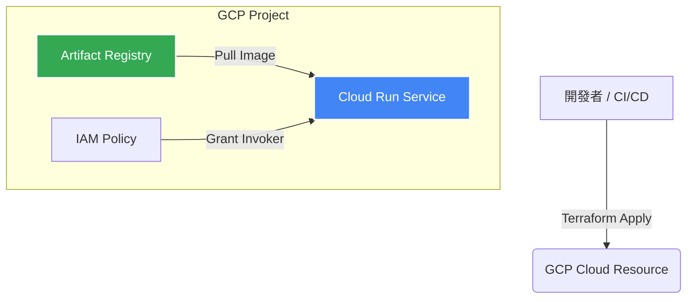

# 使用 Terraform 部署 GCP Cloud Run 實戰指南

本指南將帶領您透過 **Terraform** 在 **Google Cloud Platform (GCP)** 上自動化部署容器化應用程式至 **Cloud Run**。

---

## 1. 前言與架構總覽

Cloud Run 是 GCP 提供的無伺服器 (Serverless) 容器平台，讓您可以直接部署無狀態的容器。透過 Terraform (Infrastructure as Code, IaC)，我們可以將 Cloud Run 服務、IAM 權限與網路設定進行版本控制與自動化部署。

### 系統架構圖



---

## 2. 前置準備 (Prerequisites)

在開始編寫 Terraform 程式碼前，請確認您已備妥以下環境與工具：

1. **GCP 帳號與專案**：
   - 建立一個 GCP Project，並啟用 Billing（計費功能）。
2. **安裝必要工具**：
   - [Terraform](https://www.terraform.io/) (v1.5+)
   - [Google Cloud SDK (`gcloud`)](https://cloud.google.com/sdk)
3. **GCP 身份驗證**：
   執行以下指令登入您的 Google 帳號並設定預設專案：
   ```bash
   gcloud auth login
   gcloud auth application-default login
   gcloud config set project YOUR_PROJECT_ID
   ```
4. **啟用必要的 GCP APIs**：
   Cloud Run 需要啟用 Cloud Run API、Artifact Registry API 與 IAM API：
   ```bash
   gcloud services enable run.googleapis.com \
       artifactregistry.googleapis.com \
       iam.googleapis.com
   ```

---

## 3. Terraform 專案結構

建議建立以下目錄結構來管理您的 Terraform 設定檔：

```text
gcp-cloud-run-terraform/
├── provider.tf      # GCP Provider 與 Terraform 版本設定
├── variables.tf     # 變數定義
├── main.tf          # Cloud Run 與相關資源設定
├── outputs.tf       # 輸出結果（如服務 URL）
└── terraform.tfvars # 變數實際數值（不提交至版控）
```

---

## 4. Terraform 程式碼實作

### 4.1 `provider.tf` - 提供者設定
定義 Terraform 需要使用的 GCP Provider。

```terraform
terraform {
  required_version = ">= 1.5.0"
  required_providers {
    google = {
      source  = "hashicorp/google"
      version = "~> 5.0"
    }
  }
}

provider "google" {
  project = var.project_id
  region  = var.region
}
```

### 4.2 `variables.tf` - 變數定義
定義專案會用到的參數，提高程式碼的靈活性。

```terraform
variable "project_id" {
  description = "GCP 專案 ID"
  type        = string
}

variable "region" {
  description = "GCP 資源部署區域"
  type        = string
  default     = "asia-east1"
}

variable "service_name" {
  description = "Cloud Run 服務名稱"
  type        = string
  default     = "my-cloud-run-app"
}

variable "container_image" {
  description = "Container Image 完整路徑 (例如 Artifact Registry 上的映像檔)"
  type        = string
  default     = "us-docker.pkg.dev/cloudrun/container/hello"
}
```

### 4.3 `main.tf` - Cloud Run 核心資源
建立 Cloud Run 服務，並設定允許公開存取 (Public Access)。

```terraform
# 部署 Cloud Run 服務
resource "google_cloud_run_v2_service" "default" {
  name     = var.service_name
  location = var.region
  ingress  = "INGRESS_TRAFFIC_ALL"

  template {
    spec {
      containers {
        image = var.container_image
        
        resources {
          limits = {
            cpu    = "1000m"
            memory = "512Mi"
          }
        }

        ports {
          container_port = 8080
        }
      }
    }
  }
}

# 設定 IAM 允許公開存取 (Unauthenticated Invoker)
data "google_iam_policy" "noauth" {
  binding {
    role   = "roles/run.invoker"
    members = [
      "allUsers",
    ]
  }
}

resource "google_cloud_run_v2_service_iam_policy" "noauth" {
  project     = google_cloud_run_v2_service.default.project
  location    = google_cloud_run_v2_service.default.location
  name        = google_cloud_run_v2_service.default.name
  policy_data = data.google_iam_policy.noauth.policy_data
}
```

### 4.4 `outputs.tf` - 輸出設定
部署完成後，輸出 Cloud Run 的公開存取網址。

```terraform
output "service_url" {
  description = "Cloud Run 服務的公開訪問網址"
  value       = google_cloud_run_v2_service.default.uri
}
```

---

## 5. 部署與執行步驟

當程式碼撰寫完畢後，請依照下列步驟執行 Terraform 指令進行部署：

1. **初始化專案**（下載 GCP Provider 外掛）：
   ```bash
   terraform init
   ```

2. **建立 `terraform.tfvars` 設定實際參數**：
   ```hcl
   project_id      = "your-gcp-project-id"
   region          = "asia-east1"
   service_name    = "hello-app"
   container_image = "us-docker.pkg.dev/cloudrun/container/hello"
   ```

3. **預覽 Terraform 執行計劃 (Plan)**：
   ```bash
   terraform plan
   ```

4. **套用設定並建立資源 (Apply)**：
   ```bash
   terraform apply
   ```
   輸入 `yes` 確認執行。部署完成後，終端機會顯示 `service_url`。

---

## 6. 驗證與清理資源

### 6.1 驗證部署
您可以使用 `curl` 指令測試輸出的 URL，或直接貼至瀏覽器開啟：
```bash
curl $(terraform output -raw service_url)
```

### 6.2 清理資源
若不再需要此服務，可透過以下指令一鍵刪除所有 GCP 資源，避免產生額外費用：
```bash
terraform destroy
```
