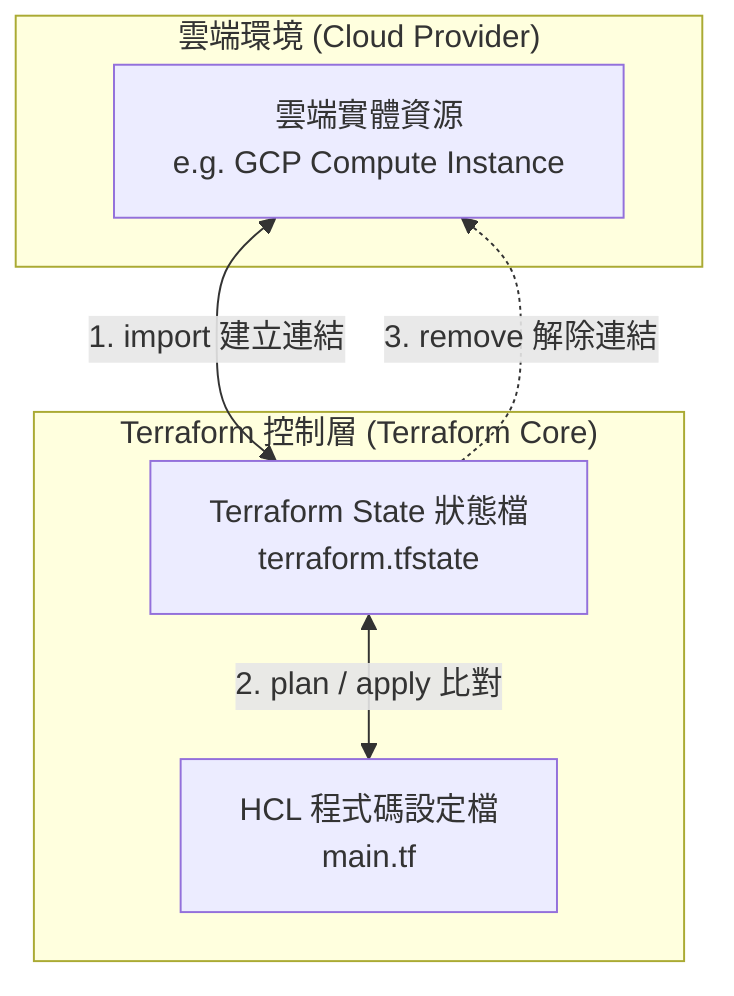

# Terraform 資源導入 (Import) 與脫離納管 (Remove) 完全指南

> 💡 **簡短摘要**：本指南深入介紹 Terraform 的資源導入 (`import`) 與脫離納管 (`remove`) 兩大核心技術，涵蓋傳統 CLI 指令與現代聲明式 (Declarative) 設定區塊，幫助您在不影響真實基礎設施的情況下靈活管理資源生命週期。

---

## 🎯 前置準備 (Prerequisites)

在開始使用 Terraform 導入與移除資源之前，請確保您的環境已符合以下條件：
- **必備工具**：
  - Terraform CLI v1.5.0+（若需使用聲明式 `import` 區塊）
  - Terraform CLI v1.7.0+（若需使用聲明式 `removed` 區塊）
  - 雲端平台 CLI 工具（例如 `gcloud` 或 `aws` CLI）並已設定好存取權限
- **先備知識**：
  - 熟悉 Terraform 基礎語法（`resource`、`provider`）與工作流程（`init`、`plan`、`apply`）
  - 理解 Terraform State（狀態檔）的作用機制

---

## 🗺️ 架構與運作原理 (Architecture & Overview)

Terraform 的管理核心在於 **真實雲端資源 (Real World)**、**程式碼 (Configuration)** 與 **狀態檔 (State File)** 三者之間的同步狀態。



- **Import (資源導入)**：將現有的真實雲端資源綁定到 Terraform State 中，並對應至 HCL 程式碼，使 Terraform 接管其生命週期。
- **Remove (脫離納管)**：將資源從 State 檔案中移除，解除 Terraform 對該資源的控制權，**不會刪除雲端上的真實資源**。

---

## 🚀 核心概念與步驟教學 (Step-by-Step Guide)

### 1. 資源導入 (Terraform Import)

#### 適用場景
- 團隊過去手動建立的雲端資源（如開發階段建立的 GCP 虛擬機器或 AWS S3 儲存桶），現在希望納入 IaC 標準化管理。
- 專案移轉或重構，需要將現有資源整合進新的 Terraform Module 中。

---

#### 方法 A：傳統 CLI `terraform import` 指令

這是最基礎的導入方式，適用於任何版本的 Terraform。

**步驟 1**：在 `main.tf` 中寫好對應的空資源區塊或完整設定：

```hcl
# main.tf
# 先宣告資源類型與名稱，屬性可先留空或設定基礎欄位
resource "google_compute_instance" "my_vm" {
  name         = "existing-vm-instance"
  machine_type = "e2-medium"
  zone         = "asia-east1-c"

  boot_disk {
    initialize_params {
      image = "debian-cloud/debian-11"
    }
  }

  network_interface {
    network = "default"
  }
}
```

**步驟 2**：執行 CLI 導入指令，將雲端實體資源 ID 綁定到 Terraform 資源位址：

```bash
# 指令格式：terraform import <資源類型>.<資源名稱> <雲端資源ID>
terraform import google_compute_instance.my_vm projects/my-gcp-project/zones/asia-east1-c/instances/existing-vm-instance
```

**步驟 3**：執行 `terraform plan` 檢查程式碼與 State 的差異，調整 `main.tf` 直到無變更發生：

```bash
# 驗證程式碼是否與實體資源狀態完全一致
terraform plan
```

---

#### 方法 B：現代聲明式 `import` 區塊 (Terraform 1.5+)

Terraform 1.5 引入了聲明式 `import` 區塊，優點是**可以進入版本控制 (Git)** 且支援**自動生成程式碼**。

**步驟 1**：在 `imports.tf` 中編寫 `import` 設定區塊：

```hcl
# imports.tf
# 宣告將雲端實體資源導入指定的 Terraform 資源位址
import {
  to = google_compute_instance.my_vm
  id = "projects/my-gcp-project/zones/asia-east1-c/instances/existing-vm-instance"
}
```

**步驟 2**：使用 `-generate-config-out` 參數讓 Terraform 自動產生資源程式碼：

```bash
# 自動根據真實資源屬性生成 HCL 設定檔
terraform plan -generate-config-out=generated_resources.tf
```

執行後，Terraform 會自動建立 `generated_resources.tf` 檔案，內容包含完整的資源屬性設定：

```hcl
# generated_resources.tf (自動生成內容範例)
resource "google_compute_instance" "my_vm" {
  name         = "existing-vm-instance"
  machine_type = "e2-medium"
  zone         = "asia-east1-c"
  # ...其他自動帶出的屬性
}
```

**步驟 3**：審查產生的程式碼並執行 `terraform apply` 完成導入：

```bash
# 套用變更完成 State 寫入與導入
terraform apply
```

---

### 2. 脫離納管 (Terraform Remove)

#### 適用場景
- 某些關鍵資源需要改由手動運營或移交給其他自動化工具管理。
- 將巨大架構拆分為多個獨立的 Terraform 專案，需要將部分資源從舊專案的 State 移除，再導入新專案。
- **注意**：`terraform destroy` 會實體刪除雲端資源；而 `remove` 僅解除控制權，資源持續運行。

---

#### 方法 A：傳統 CLI `terraform state rm` 指令

**步驟 1**：確認要移除的資源名稱：

```bash
# 列出目前 State 中的所有資源位址
terraform state list
```

**步驟 2**：執行 `terraform state rm` 將資源自 State 中剔除：

```bash
# 將特定的資源從 State 中刪除（雲端資源本體不會被刪除）
terraform state rm google_compute_instance.my_vm
```

**步驟 3**：手動刪除或註解 `main.tf` 中對應的 `resource` 區塊，避免下次 `terraform plan` 時再度建議建立該資源：

```hcl
# main.tf
# 已脫離納管，請刪除或註解此區塊
# resource "google_compute_instance" "my_vm" {
#   ...
# }
```

---

#### 方法 B：現代聲明式 `removed` 區塊 (Terraform 1.7+)

Terraform 1.7 引入了 `removed` 區塊，讓脫離納管的操作也能透過代碼審查 (Code Review) 與 CI/CD 流程執行。

**步驟 1**：在 HCL 中加入 `removed` 區塊，並移除原有的 `resource` 區塊：

```hcl
# removed.tf
# 聲明某個資源已被移除納管，但實體資源需保留 (destroy = false)
removed {
  from = google_compute_instance.my_vm

  lifecycle {
    destroy = false
  }
}
```

**步驟 2**：執行 `terraform plan` 檢視預估變更：

```bash
# plan 會顯示該資源將從 State 移除，且不會觸發實體刪除
terraform plan
```

**步驟 3**：執行 `terraform apply` 完成變更：

```bash
# 執行 apply 後，Terraform 會更新 State 並自動清除 removed 區塊的影響
terraform apply
```

---

## 🛡️ 最佳實踐與安全建議 (Best Practices & Security)

在進行 State 操作時，安全是第一優先事項。請遵循以下原則：

1. **強制備份 State 檔案**：
   在執行任何 `import` 或 `state rm` 指令前，先匯出備份：
   ```bash
   terraform state pull > backup_state_$(date +%Y%m%d_%H%M%S).tfstate
   ```
2. **謹慎處理預設刪除行為**：
   使用 `removed` 區塊時，務必確認 `lifecycle { destroy = false }`，否則預設行為仍可能進行實體刪除。
3. **充分利用 `terraform plan`**：
   不論是導入或移除，務必詳細審查 `plan` 的輸出結果，確保沒有未預期的 `must be replaced` 或 `destroy` 動作。
4. **團隊溝通與 State 鎖定**：
   若使用遠端 State（如 GCP GCS 或 AWS S3 bucket），確保啟用 State Locking 機制，避免多人同步執行導致 State 衝突損毀。

---

## 🔍 常見問題 & 故障排除 (Troubleshooting)

### Q1: 執行 `terraform import` 後，`terraform plan` 卻提示資源必須「重新建立 (Recreated)」？
- **原因**：設定檔 `main.tf` 中的某些強制替換欄位（如 `zone` 或 `name`）與雲端實體資源的真實設定不一致，導致 Terraform 認定需要毀壞重建。
- **解決方案**：
  1. 檢查 `terraform plan` 顯示的 `+# force replacement` 項目。
  2. 修改 `main.tf`，使其屬性值與實體資源完全吻合。

### Q2: 執行 `terraform state rm` 後，執行 `terraform plan` 為什麼又提示要「建立 (Create)」新資源？
- **原因**：`terraform state rm` 僅移除了 State 記錄，但 `main.tf` 中仍保留該 `resource` 區塊。Terraform 比對 State 時發現無紀錄，便以為這是新定義的資源。
- **解決方案**：從 `main.tf` 中刪除或註解該 `resource` 區塊，或改用 Terraform 1.7+ 的 `removed` 區塊處理。

### Q3: 聲明式 `import` 區塊在 `apply` 成功後該如何處置？
- **原因**：`import` 區塊已經完成歷史任務。
- **解決方案**：完成 `apply` 後，可安全地從 `.tf` 檔案中刪除 `import` 區塊，僅保留生成或撰寫好的 `resource` 區塊即可。

---

## 📚 延伸閱讀 (References & Further Reading)
- [Terraform Official Documentation: Import](https://developer.hashicorp.com/terraform/language/import)
- [Terraform Official Documentation: State Command](https://developer.hashicorp.com/terraform/cli/commands/state)
- [Terraform 1.5 Subcommand & Declarative Import Announcement](https://www.hashicorp.com/blog/terraform-1-5-brings-declarative-import-and-checks)
- [Terraform 1.7 Removed Block Announcement](https://www.hashicorp.com/blog/terraform-1-7-adds-test-execution-and-removed-block)
